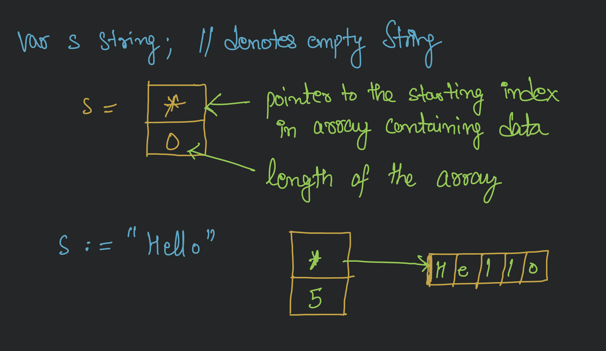
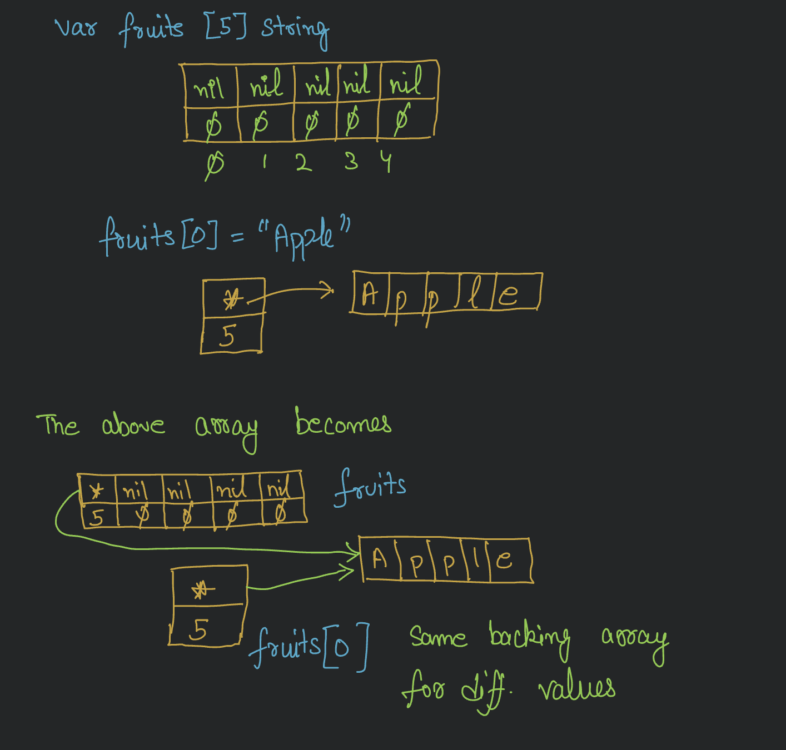

### Strings

String in go is a 2 word or 8/16 byte(depending on architecture) data structure.



Q. What is the cost of the assignment in this?

```go
fruits[0] = "Apple"
```

- Assignment is copy operation. So, the question is what is being copied here. Since, String is a 2 word data structure,
  all we will be copying is a 2 word data structure.
- Remember pointer is for sharing and here pointer gives us ability to share the backing array across distinct values.



### Iterations

Go only gives `for` statement for all of its iterations. There are different ways to use it though.

1. You can use a traditional `for` loop

```go
// Declare an array of 4 integers intialised with some values
numbers := [4]int{10, 20, 30, 40}

//Iterate over the array of numbers

for i:=0; i< len(numbers); i++ {
    fmt.println(i, numbers[i])
}
```

2. Golang also provides a `for range` operator. It is very special and powerful iterator. It comes with 2 different
   semantics.
    - [Value Semantics](/1.Basic/2.Sematics.md#value-semantics)
    - [Pointer Semantics](/1.Basic/2.Sematics.md#pointer-semantics)

   ##### Examples:

   Below code follows pointer semantics.

    ```go
   // Using the pointer semantic form of the for range.
   friends = [5]string{"Annie", "Betty", "Charley", "Doug", "Edward"}
   fmt.Printf("Bfr[%s] : ", friends[1])

   for i := range friends {
      friends[1] = "Jack"
      if i == 1 {
         fmt.Printf("Aft[%s]\n", friends[1])
      }
   }
   ```

   Here, since it is using pointer to same data(array of string), it's output is:

   ```go
   Bfr[Betty] : Aft[Jack]
   ```
   But we do the same thing using value semantics, it behaves differently. Below code follows value semantics. Here,
   local variable fruit is going to be a copy of every value that we are
   iterating over. This is because, **before iteration only, it will create a copy of original friends array, and we
   would be iterating over that copy**. So, any changes made to copy, won't reflect on the original array.
   While changing the value of 1st index of the friendsCopy, it will create a new backing array with value jack and
   change the pointer and length in the copy array, so our original array remains intact.
   ```go
   // Using the value semantic form of the for range.
   friends = [5]string{"Annie", "Betty", "Charley", "Doug", "Edward"}
   fmt.Printf("Bfr[%s] : ", friends[1])

   for i, v := range friends {
      friends[1] = "Jack"

      if i == 1 {
			fmt.Printf("v[%s]\n", v)
      }
   }
   ```

   We get the expected output here

   ```go
   Bfr[Betty] : v[Betty]
   ``` 
   > **_NOTE:_**  Both of the semantics have their pros and cons, but we should never mix them as it makes the code
   complicated and hard to read.

   For instance, look at below code. Here, we are using value semantics with pointer semantics. We are making a copy of
   address of the original friends array. So, if we update anything, we are changing the value at the address copy,
   i.e., the original array only. But it is difficult to deduce it by reading the code.

   ```go
   // Using the value semantic form of the for range but with pointer
   //semantic access. DON'T DO THIS.
   friends = [5]string{"Annie", "Betty", "Charley", "Doug", "Edward"}
   fmt.Printf("Bfr[%s] : ", friends[1])

   for i, v := range &friends {
      friends[1] = "Jack"
      if i == 1 {
         fmt.Printf("v[%s]\n", v)
      }
   }
   ```
   Output here will be same as pointer semantics
   ```go
   Bfr[Betty] : v[Jack]
   ```
   
   
   