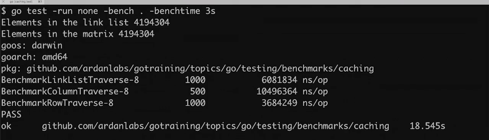
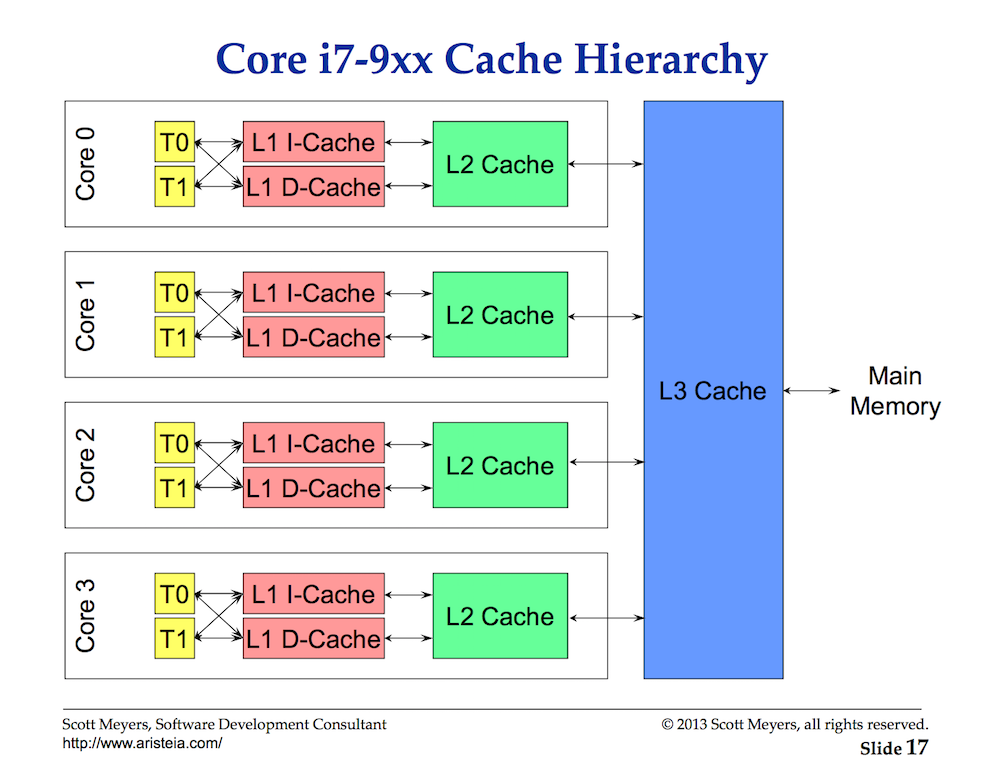

#### Golang have only 3 data structures:

- [**Arrays**](3.Arrays.md)
- [**Slices**](4.Slices.md)
- [**Maps**](5.Maps.md)

### TLdr;

___
> - Predictable access patterns matter as it maintains mechanical sympathy
> - Arrays, slices and map in go provides the predictable patterns
> - Maintain mechanical sympathies until it's not reasonable or practical to do so, and this is why Go's just given us
    the array, the slice, and the map.


To Fully understand why Go have only 3 types of data structure, let's understand the mechanics of memory allotment and
processor. This can be explained by a simple benchmarking. Let's go through [martix program](resources/matrix.go)
and [it's benchmark](resources/matrix_test.go)

Now, when we run benchmark using this command

```
go test -run none -bench . -benchtime 3s
```

We get the below result



This is due to varying speed of the cache at different level. If you go through
the [below videos on cache](#cpu-caches), it shows animation for the same.

> Level one, superfast, level two, a little slower, level three, still pretty slow, but we got it done, and then level
> four, main memory, very very slow.

## CPU Caches

[CPU Caches and Why You Care (18:50-20:30)](https://youtu.be/WDIkqP4JbkE?t=1129) - Scott Meyers  
[CPU Caches and Why You Care (44:36-45:40)](https://youtu.be/WDIkqP4JbkE?t=2676) - Scott Meyers   
[Performance Through Cache-Friendliness (4:25-5:48)](https://youtu.be/jEG4Qyo_4Bc?t=266) - Damian Gryski

## CPU Cache Notes

* CPU caches works by caching main memory on cache lines.
* Cache lines today are either 32 or 64 bytes wide depending on the hardware.
* Cores do not access main memory directly. They tend to only have access their local caches.
* Both data and instructions are stored in the caches.
* Cache lines are shuffled down L1->L2->L3 as new cache lines need to be stored in the caches.
* Hardware likes to traverse data and instructions linearly along cache lines.
* Main memory is built on relatively fast cheap memory. Caches are built on very fast expensive memory.

* Access to main memory is incredibly slow, we need the cache.
    * Accessing one byte from main memory will cause an entire cache line to be read and cached.
    * Writes to one byte in a cache line requires the entire cache line to be written.

* Small = Fast
    * Compact, well localized code that fits in cache is fastest.
    * Compact data structures that fit in cache are fastest.
    * Traversals touching only cached data is the fastest.

* Predictable access patterns matter.
    * Whenever it is practical, you want to employ a linear array traversal.
    * Provide regular patterns of memory access.
    * Hardware can make better predictions about required memory.
    * Creates a situation where the cache line can be inside L1 or L2 before we need it.
    * This maintains mechanically sympathetic with the hardware. If performance matters, then what we have to do is be
      much more efficient with how data gets in to the processor, not get the processors to run at higher clock speed.
      Predictable access patterns to memory is everything.
    * The simplest way create predictable pattern: If you allocate a contiguous block of memory, and you walk through
      that memory on a predictable stride, well guess what, the prefetchers, which is little software sitting inside the
      processor, the prefetchers can pick up on that data access, and start bringing in those cache lines way ahead of
      when you need them.
    * The prefetchers are everything, and we must be sympathetic with them. Now, the cleanest and **easiest way to
      create this predictable access pattern is to use an array**, an array gives us the ability to allocate a
      contiguous block of memory, and when you define an array, you define it based on an element size, it's an array of
      string, it's an array of int, there's our predictable stride, every index is a predictable stride from the other.
    * Prefetchers love arrays, the hardware loves arrays, it really is the most important data structure there is today
      from the hardware. And I almost don't even care what your algorithms are, an array is going to beat it.
    * Now there are times when maybe you're dealing with data that is so large that a linear traversal isn't going to be
      more efficient, but overall, if you're dealing with data, small data, that array and those predictable access
      patterns are going to beat out performance every time on these traversals.
    * Alright, so the array is the most important data structure as it relates to the hardware, but I need to make it
      clear, the array is not the most important data structure in Go. The slice is the most important data structure in
      Go. And this isn't because the slice uses an array underneath, technically, **slice is really a vector**, and if
      you've watched any C++ videos over the last five years, and go to CPP Khan and look, and if you see any CPP Khan
      video over the last five years of talking about performance, you will hear the person on stage say, vectors,
      vectors, vectors, vectors, vectors, use vectors. Why, because, just like the slice, we're gonna be using arrays
      behind the scenes, we're gonna be doing those linear iterations, and we're gonna be creating predictable access
      patterns to memory that the prefetchers are going to pick up on.
    * Now, there's another cache in the hardware called the **TLB**, this cache is also very important. When we talk
      about how the operating system manages memory, the operating system manages memory at a granularity called a page.
      Now, operating system pages can vary in size, anywhere from 4K, 8K, 16K, there's even some Linux distributions
      that use two meg pages, and this is why.
    * The TLB is a very special cache that the operating system is gonna be managing. And what it does is it creates a
      cache of virtual addresses to operating system page and physical memory locations. In other words, your program is
      working in virtual memory, it thinks it's got real memory, but it's not, right, it's given a full virtual memory,
      because the operating system gives it that level of abstraction. So when you say, go get me the value at this
      address, this virtual address, the TLB is there so the hardware can do a very quick lookup, "Hey, where is this
      virtual address "for this process physically located in RAM?" That's the TLB, now, if you're getting TLB cache
      misses, and remember, these are caches, these are small caches, high performing caches, but they're small, and if
      you're getting a TLB miss, now what has to happen is the hardware's gotta go ask the operating system, "Where is
      this thing?" and there has to be, like, a traversal around the operating system paging table. And if you're on a
      virtual machine, like a cloud environment, you know, those virtual machines also have their own paging tables. *
      *You know, a TLB miss could be really, really deadly, and so these predictable access patterns are not just
      helping with cache lines, they're also helping with making sure the TLB is also properly cached, so all of this
      access to memory is as fast as possible.**
    * Again, performance today is not about how fast we can churn that clock, how fast we can push the clock in terms of
      cycles per nanosecond, it's about how efficiently we can get data into the processor before we need it, so we can
      reduce all of the latency there is in accessing data, especially in main, and if we can even reduce more of the L3
      latency, well guess what, we're better off.

* Cache misses can result in TLB cache misses as well.
    * Cache of translations of a virtual address to a physical address.
    * Waiting on the OS to tell us where the memory is.

### Cache Hierarchies

This is a diagram showing the relationship of the cache hierarchy for the 4 Core i7-9xx processor. The caches in the
diagram are not to scale. This processor has four cores and each core has two hardware threads. The hardware threads per
core share the Level 1 caches. The cores have individual Level 1 and Level 2 caches. All cores for all the processor
share the L3 cache.



This is subject to be different in different processors. For this content, the following is the multi-levels of cache
associated with the Intel 4 Core i7-9xx processor:

### Intel i7 CPU Latencies From Video

```
3GHz(3 clock cycles/ns) * 4 instructions per cycle = 12 instructions per ns!

1 ns ............. 1 ns .............. 12 instructions  (one) 
1 µs .......... 1000 ns .......... 12,000 instructions  (thousand)
1 ms ..... 1,000,000 ns ...... 12,000,000 instructions  (million)
1 s .. 1,000,000,000 ns .. 12,000,000,000 instructions  (billion)

L1 - 64KB Cache (Per Core)
	4 cycles of latency at 1.3 ns
	Stalls for 16 instructions

L2 - 256KB Cache (Per Core)
	12 cycles of latency at 4 ns
	Stalls for 48 instructions

L3 - 8MB Cache
	40 cycles of latency at 13.3 ns
	Stalls for 160 instructions

Main Memory
	100 cycle of latency at 33.3 ns
	Stalled for 400 instructions
```

### Industry Defined Latencies

```
L1 cache reference ......................... 0.5 ns ...................  6 ins
Branch mispredict ............................ 5 ns ................... 60 ins
L2 cache reference ........................... 7 ns ................... 84 ins
Mutex lock/unlock ........................... 25 ns .................. 300 ins
Main memory reference ...................... 100 ns ................. 1200 ins           
Compress 1K bytes with Zippy ............. 3,000 ns (3 µs) ........... 36k ins
Send 2K bytes over 1 Gbps network ....... 20,000 ns (20 µs) ........  240k ins
SSD random read ........................ 150,000 ns (150 µs) ........ 1.8M ins
Read 1 MB sequentially from memory ..... 250,000 ns (250 µs) .......... 3M ins
Round trip within same datacenter ...... 500,000 ns (0.5 ms) .......... 6M ins
Read 1 MB sequentially from SSD* ..... 1,000,000 ns (1 ms) ........... 12M ins
Disk seek ........................... 10,000,000 ns (10 ms) ......... 120M ins
Read 1 MB sequentially from disk .... 20,000,000 ns (20 ms) ......... 240M ins
Send packet CA->Netherlands->CA .... 150,000,000 ns (150 ms) ........ 1.8B ins
```


#### CPU Caches / Memory

[CPU Caches and Why You Care - Video](https://www.youtube.com/watch?v=WDIkqP4JbkE) - Scott Meyers  
[A Crash Course in Modern Hardware - Video](https://www.youtube.com/watch?v=OFgxAFdxYAQ) - Cliff Click  
[NUMA Deep Dive Series](http://frankdenneman.nl/2016/07/06/introduction-2016-numa-deep-dive-series/) - Frank Denneman

[CPU Caches and Why You Care - Deck](http://www.aristeia.com/TalkNotes/codedive-CPUCachesHandouts.pdf) - Scott Meyers  
[Mythbusting Modern Hardware to Gain 'Mechanical Sympathy'](https://www.youtube.com/watch?v=MC1EKLQ2Wmg) - Martin
Thompson  
[What Every Programmer Should Know About Memory](http://www.akkadia.org/drepper/cpumemory.pdf) - Ulrich Drepper  
[How CPU Caches Work and Why](http://www.extremetech.com/extreme/188776-how-l1-and-l2-cpu-caches-work-and-why-theyre-an-essential-part-of-modern-chips) -
Joel Hruska  
[Modern Microprocessors A 90 Minute Guide](http://www.lighterra.com/papers/modernmicroprocessors) - Jason Robert Carey
Patterson  
[Memory part 2: CPU caches](http://lwn.net/Articles/252125) - Ulrich Drepper  
[The Free Lunch Is Over](http://www.gotw.ca/publications/concurrency-ddj.htm) - Herb Sutter  
[Data Center Computers: Modern Challenges in CPU Design](https://m.youtube.com/watch?feature=youtu.be&v=QBu2Ae8-8LM) -
Dick Sites  
[Wirth's Law](https://en.wikipedia.org/wiki/Wirth%27s_law) - Wikipedia  
[Eliminate False Sharing](http://www.drdobbs.com/parallel/eliminate-false-sharing/217500206) - Herb Sutter  
[The Myth Of Ram](http://www.ilikebigbits.com/2014_04_21_myth_of_ram_1.html) - Emil Ernerfeldt  
[Understanding Transaction Hardware Memory](https://www.infoq.com/presentations/hardware-transactional-memory) - Gil
Gene  
[Performance Through Cache-Friendliness (4:25-5:48)](https://youtu.be/jEG4Qyo_4Bc?t=266) - Damian Gryski  
[Going Nowhere Faster](https://www.youtube.com/watch?v=2EWejmkKlxs) - Chandler Carruth  
[Making the Invisible Visible: Observing Complex Software Dynamics](https://www.youtube.com/watch?v=D_qRuKO9qzM) - Dick
Sites

#### Data-Oriented Design

[Data-Oriented Design and C++](https://www.youtube.com/watch?v=rX0ItVEVjHc) - Mike Acton  
[Efficiency with Algorithms, Performance with Data Structures](https://www.youtube.com/watch?v=fHNmRkzxHWs) - Chandler
Carruth  
[Taming the performance Beast](https://www.youtube.com/watch?v=LrVi9LHP8Bk) - Klaus Iglberger

[Pitfalls of OOP](http://harmful.cat-v.org/software/OO_programming/_pdf/Pitfalls_of_Object_Oriented_Programming_GCAP_09.pdf) -
Tony Albrecht  
[Why you should avoid Linked Lists](https://www.youtube.com/watch?v=YQs6IC-vgmo) - Bjarne Stroustrup  
[Data-Oriented Design (Or Why You Might Be Shooting Yourself in The Foot With OOP)](http://gamesfromwithin.com/data-oriented-design) -
Noel    
[Was object-oriented programming a failure?](https://www.quora.com/Was-object-oriented-programming-a-failure) - Quora

## Code Review

[Declare, initialize and iterate](example1/example1.go) ([Go Playground](https://play.golang.org/p/OIh-XVdDSZb))  
[Different type arrays](example2/example2.go) ([Go Playground](https://play.golang.org/p/KmXH8Z9F3Rh))  
[Contiguous memory allocations](example3/example3.go) ([Go Playground](https://play.golang.org/p/guj-ZvSF0qS))  
[Range mechanics](example4/example4.go) ([Go Playground](https://play.golang.org/p/cx4GEViWjC7))

## Exercises

### Exercise 1

Declare an array of 5 strings with each element initialized to its zero value. Declare a second array of 5 strings and
initialize this array with literal string values. Assign the second array to the first and display the results of the
first array. Display the string value and address of each element.

[Template](exercises/template1/template1.go) ([Go Playground](https://play.golang.org/p/yURUYyZ5_hA)) |
[Answer](exercises/exercise1/exercise1.go) ([Go Playground](https://play.golang.org/p/VtuGj8S-K2l))


